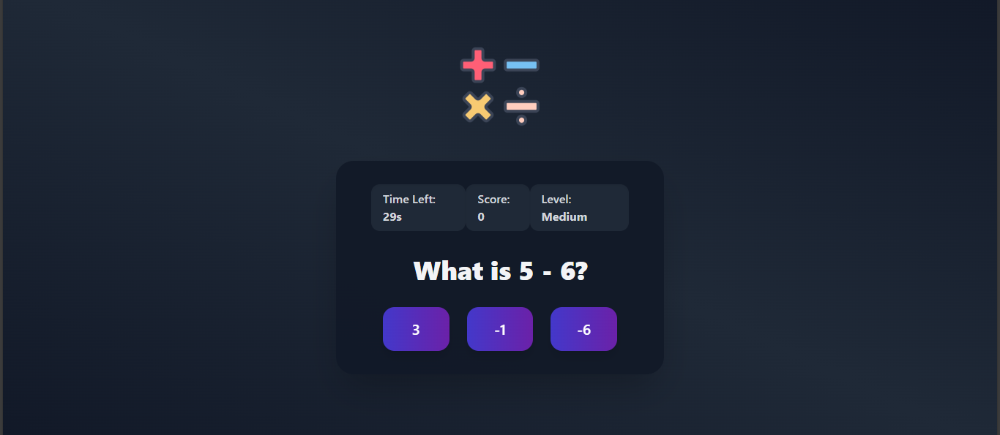

# 🧩 Math Game

A smooth and responsive sliding puzzle game built with **React** and **Tailwind CSS**.  
Test your logic and enjoy solving puzzles using randomly chosen images!





---

## 🚀 Live Demo

🔗 [Play the game](https://math-game-3.vercel.app/)

---

## 🎮 Features

- ✅ Random image selected from `/public/images/` on each game
- ✅ Smooth sliding animation using Tailwind transitions
- ✅ Win detection and celebration message
- ✅ Empty tile is filled with the correct image piece after winning
- ✅ Fully responsive design (desktop & mobile)

---

## 🛠️ Tech Stack

- **React**
- **Vite**
- **Tailwind CSS**
- **JavaScript (ES6)**

---

## 📦 Installation

1. **Clone the repo**
   ```bash
   git clone https://github.com/abdessadekbirama/game3.git
   cd game3
2. **Install dependencies**
   ```bash
   npm install
3. **Run locally**
   ```bash
   npm run dev
3. **Open Browser**
   ```bash
   http://localhost:5173